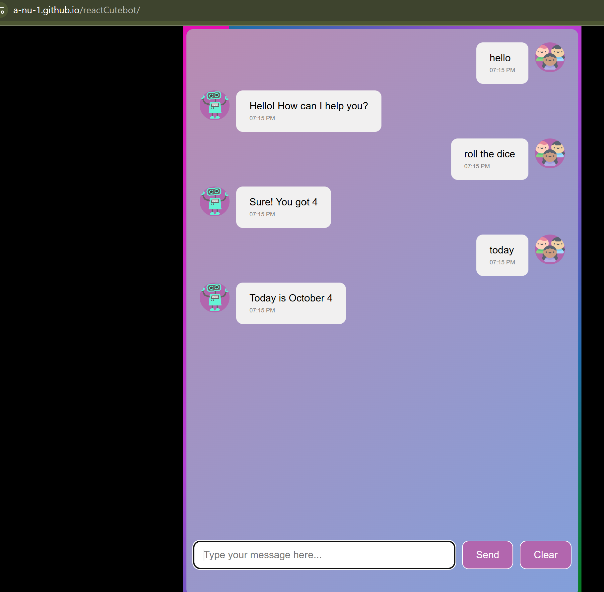

# React CuteBot

A playful chatbot experiment built with React that responds to simple conversational messages and interactive commands.

The project explores basic chatbot-style interaction, React state management, and creating a lightweight conversational user interface.

🌐 **Live Demo:**  
https://a-nu-1.github.io/reactCutebot/

---

## Screenshot



---

## About This Project

React CuteBot is a small interactive React project designed around simple conversational interactions.

Users can type messages and commands and receive corresponding responses from the bot.

Example interactions include:

- greetings
- simple conversational responses
- date-related commands
- playful commands such as rolling a dice

---

## Features

- Chat-style user interface
- Text input
- Interactive bot responses
- Simple command handling
- Dice-roll interaction
- Date-related response
- Lightweight conversational experience

---

## Example Flow

```text
User enters message
       ↓
React handles input
       ↓
Command / text is evaluated
       ↓
CuteBot chooses a response
       ↓
Response appears in chat
```

---

## What This Project Demonstrates

This project demonstrates:

- React fundamentals
- component-based UI
- state management
- user input handling
- conditional logic
- interactive frontend behavior
- simple chatbot-style application design

---

## Tech Stack

- React
- JavaScript
- HTML
- CSS
- GitHub Pages

---

## Running Locally

### 1. Clone the repository

```bash
git clone https://github.com/A-nu-1/reactCutebot.git
```

### 2. Enter the project directory

```bash
cd reactCutebot
```

### 3. Install dependencies

```bash
npm install
```

### 4. Start the development server

Depending on the scripts configured in the project:

```bash
npm start
```

or:

```bash
npm run dev
```

---

## Deployment

The project is hosted using **GitHub Pages**.

Live application:

https://a-nu-1.github.io/reactCutebot/

---

## Possible Future Enhancements

- larger command library
- richer conversational responses
- persistent conversation history
- themes
- animations
- improved mobile UI
- external API integration
- natural-language processing experiments

---

## Author

**Anupama Rajendra**

Software Engineer  
**Java · SQL · Unix / Shell Scripting · Enterprise Integration · Full-Stack · Mobile**

### Links

**Portfolio**  
https://A-nu-1.github.io/anupamaportfolio/

**GitHub**  
https://github.com/A-nu-1

---

## Screenshot File

The screenshot used in this README should be stored beside `README.md`:

- `react-cutebot.png`

---

## Project Purpose

React CuteBot is a small frontend experiment focused on React interaction, simple command processing, and conversational UI design.